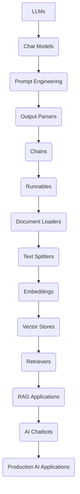

# 🚀 LangChain Learning Journey

<p align="center">


</p>

---

## 👋 About this Repository

Welcome!

This repository documents my **hands-on learning journey with LangChain and Large Language Models (LLMs)**. Rather than simply reading documentation, I believe the best way to learn is by building, experimenting, making mistakes, and understanding how each component works behind the scenes.

Every folder in this repository represents a concept that I explored through code examples, experiments, and notebooks.

This repository is continuously updated as I learn more about the LangChain ecosystem and modern Generative AI development.

---

# 🎯 Learning Objectives

- Understand how Large Language Models work
- Learn Prompt Engineering techniques
- Build applications using LangChain
- Work with multiple LLM providers
- Understand Embeddings & Vector Databases
- Learn Retrieval-Augmented Generation (RAG)
- Build AI Chatbots
- Prepare for production-ready AI applications

---

# 📚 Repository Structure

```
LangChain-Learning
│
├── 1.LLMs
│   ├── LLM Fundamentals
│   ├── OpenAI Models
│   ├── Groq Models
│   └── Hugging Face Models
│
├── 2.ChatModels
│   ├── ChatOpenAI
│   ├── ChatGroq
│   └── Chat Interfaces
│
├── 3.EmbeddedModels
│   ├── Embeddings
│   ├── Similarity Search
│   └── Semantic Search
│
├── 4.Chatbot
│   ├── AI Chatbot Examples
│   └── Conversation Flow
│
├── 5.Prompts
│   ├── Prompt Templates
│   ├── Few-shot Prompting
│   └── Dynamic Prompting
│
├── 6.StructuredOP
│   ├── Structured Outputs
│   └── Pydantic Models
│
├── 7.Output_Parser
│   ├── JSON Parser
│   ├── String Parser
│   └── Custom Parsers
│
├── 8.Chain
│   ├── Sequential Chains
│   ├── Parallel Chains
│   └── Chain Composition
│
├── 9.Runnables
│   ├── RunnableLambda
│   ├── RunnableSequence
│   └── RunnableParallel
│
├── 10.Doc_Loader
│   ├── PDF Loader
│   ├── Text Loader
│   └── Web Loader
│
├── 11.Text_Splitter
│   ├── Recursive Splitter
│   ├── Character Splitter
│   └── Token Splitter
│
├── 12.Vector_Stores
│   ├── ChromaDB
│   ├── FAISS
│   └── Vector Indexing
│
├── 13.Retrievers
│   ├── Multi Query Retriever
│   ├── Contextual Compression
│   ├── Wikipedia Retriever
│   └── Vector Retriever
│
├── requirements.txt
├── .gitignore
└── README.md
```

---

# 🧠 Learning Flow



---

# 🛠 Technologies Used

- Python
- LangChain
- OpenAI API
- Groq API
- Hugging Face
- Google Gemini
- Anthropic Claude
- Pydantic
- dotenv
- Jupyter Notebook

---

# 📖 Topics Covered

## ✅ Large Language Models

- What are LLMs?
- Temperature
- Tokens
- Context Window
- API Integration

---

## ✅ Chat Models

- ChatOpenAI
- ChatGroq
- Human Messages
- AI Messages
- System Messages

---

## ✅ Prompt Engineering

- Prompt Templates
- Chat Prompt Templates
- Partial Prompts
- Few-shot Prompting

---

## ✅ Structured Outputs

- Pydantic
- JSON Output
- Response Schema

---

## ✅ Output Parsers

- String Parser
- JSON Parser
- Structured Parser

---

## ✅ Chains

- Sequential Chains
- Parallel Chains
- Pipeline Design

---

## ✅ Runnables

- RunnableLambda
- RunnableSequence
- RunnableParallel
- RunnablePassthrough

---

## ✅ Document Loaders

- PDF
- TXT
- Web Pages

---

## ✅ Text Splitters

- Recursive Character Splitter
- Character Splitter
- Token Splitter

---

## ✅ Embeddings

- Embedding Models
- Semantic Search
- Similarity Search

---

## ✅ Vector Stores

- FAISS
- ChromaDB
- Indexing
- Retrieval

---

## ✅ Retrievers

- Multi Query Retriever
- Contextual Compression Retriever
- Wikipedia Retriever
- Vector Store Retriever

---

# 🔒 Environment Variables

Create a `.env` file and add your API Keys.

```env
OPENAI_API_KEY=your_key

GROQ_API_KEY=your_key

HUGGINGFACEHUB_API_TOKEN=your_key

GEMINI_API_KEY=your_key

ANTHROPIC_API_KEY=your_key
```

⚠️ **Never push your `.env` file to GitHub.**

---

# 📈 Current Progress

| Module | Status |
|----------|--------|
| LLMs | ✅ Completed |
| Chat Models | ✅ Completed |
| Prompt Engineering | ✅ Completed |
| Structured Output | ✅ Completed |
| Output Parsers | ✅ Completed |
| Chains | ✅ Completed |
| Runnables | ✅ Completed |
| Document Loaders | ✅ Completed |
| Text Splitters | ✅ Completed |
| Embeddings | ✅ Completed |
| Vector Stores | ✅ Completed |
| Retrievers | ✅ Completed |
| **Retrieval-Augmented Generation (RAG)** | ✅ Completed |
| AI Agents | ⏳ Upcoming |
| LangGraph | ⏳ Upcoming |

---

# 🚀 What's Next?

- Retrieval-Augmented Generation (RAG)
- Memory
- LangGraph
- AI Agents
- Tool Calling
- FastAPI Integration
- Production-ready AI Applications

---

# 💡 Why this Repository?

This repository is my personal learning log where I experiment with LangChain concepts through practical examples instead of just following tutorials.

My goal is to build a strong foundation in Generative AI and eventually develop scalable AI-powered applications.

---

# 👨‍💻 Author

**Ashu Yadav**

Third Year Electronics & Telecommunication Engineering Student  
Symbiosis Institute of Technology, Pune

Interested in:

- Artificial Intelligence
- Large Language Models
- Retrieval-Augmented Generation
- AI Engineering
- Backend Development

---

⭐ If you find this repository useful, feel free to star it!
